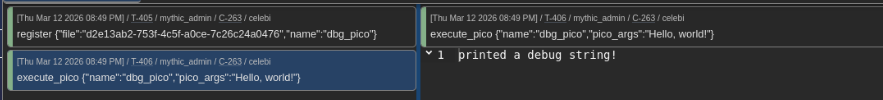
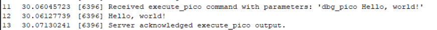

# Celebi

*Crystal + Mythic = Celebi*

A WIP Mythic agent for x64 Windows that uses Crystal Palace to build its payloads.

To be clear, this agent is an unfinished WIP, and it is also not opsec safe. Please don't try to use it in a real red team engagement.

Current features:

- Performs a plaintext checkin with the specified C2 server via HTTP(S).
- Supports the `callback_host` and `callback_port` parameters to specify the C2 listener.
- Supports the `post_uri` parameter to specify the URI for checking in.
- Supports the `exit` and `whoami` built-in commands.
- Supports a `register` and `unregister` command to upload or delete files from the agent's memory vault.
- Supports an `execute_pico` command to interpret a registered file as a Crystal Palace PICO and run it.
- Supports a `morph` command to hotswap the PICO used by a built-in command, replacing it with a registered file.
- Performs basic XOR-based sleepmasking of the memory vault, implemented as a PICO so you can swap it out if desired.
- Does not perform sleepmasking of the executable PIC, but offers a PICO hook so you can swap in your own implementation if desired.

Current limitations:

- Only implements basic functionality
- Only supports x64 architectures
- Only communicates using plaintext (no AES256)
- Only supports the http C2 profile
- Ignores most C2 profile parameters
- Fairly opsec unsafe, some basic (but limited) obfuscation measures are implemented
- Very little error handling, will probably crash if something unexpected happens
- The `register` command uses a very simple/naive "memory vault" implementation that endlessly grows as you register more files.
- Likewise, the `unregister` command literally just zeroes out the file and replaces its name with a dummy string.

Longterm goals:

- Fully implement parameters from the http C2 profile
- Implement AES256 traffic encryption
- Port over more of TrustedSec's situational awareness BOFs (GPL) and use them to provide some built-in PICO commands to the agent.
- Implement `execute_bof` and `execute_shellcode` commands as a supplement to the `execute_pico` command.
- Support other C2 profiles
- Include YARA rules for the "default" build of the agent

> This project is released strictly for educational purposes, and is intended solely for use by authorised parties performing legitimate security research and red team assessments. My only intention is to share my work for the purposes of uplifting security.

## Installation

1. Clone the repository and copy both `celebi` and `celebi_translator` to your `Mythic/InstalledServices` folder.
2. Add them both to your docker-compose file: `mythic-cli add celebi` and `mythic-cli add celebi_translator`.
3. Build both containers: `mythic-cli build celebi` and `mythic-cli build celebi_translator`.
4. Build payloads for Celebi using the http C2 profile. You can use HTTP or HTTPS, but make sure that `AESPSK` is set to "none". 

## Design

*Note that the design described here represents my aspirations for Celebi rather than its current state.*

The overall design goal of Celebi is to hardcode as little functionality as possible. Instead, we implement basic functionality such as sleep masking, information gathering, or command execution into a set of PICOs that are linked into the final implant. The PICOs that ship with Celebi by default are intended to "just work" without being opsec safe, but they can be replaced with your own custom Crystal Palace PICOs that implement the same interface.

The list of built-in PICOs currently includes:

- `checkin.c`: Performs basic information gathering about the target system and uses the collected data to enrich a `CheckinRequest` struct.
- `mask_vault.c`: One half of celebi's sleep masking functionality. Performs XOR-based obfuscation of the memory vault used to store PICOs in memory.
- `mask_sleep.c`: The other half of celebi's sleep masking functionality. Does nothing but invoke `WaitForSingleObject()`, but you can swap it out for a custom sleepmasking implementation.
- `whoami.c`: A port of the whoami BOF from TrustedSec's CS-Situational-Awareness-BOF repository. Used by the `whoami` built-in command.

In addition, the design calls for the ability to change every aspect of the implant while it is running. You can upload new PICO capabilities with the `register` command, and you can replace built-in functionality with the `morph` command. 

For example, if you register a PICO named `custom_whoami` with the agent, you can replace the built-in `whoami` command with it by running `morph whoami custom_whoami`. This will also unregister the old PICO and clear it from memory. This allows your agent to dynamically change its TTPs and behaviour without recompiling the underlying shellcode.

I don't intend to write a large number of commands for this agent. Beyond basic convenience commands like `whoami` or `download`, the plan is for most of the agent's capabilities to be loaded *after* it starts running, in the form of BOFs or PICOs. I plan to provide support for both. Likewise, I don't plan to implement many (or maybe any) of Mythic's "optional" commands, because most of the implant's capabilities are intended to be loaded in remotely with `register` and `execute_pico`.

## Example: Executing a PICO

The function signature for a generic PICO that celebi knows how to execute is:

```c
typedef char *(*GENERIC_PICO)(char *cmdline);
```

Here's an example of a very simple PICO that implements this interface:

```c
#include <windows.h>
 
WINBASEAPI VOID WINAPI KERNEL32$OutputDebugStringA (LPCSTR lpOutputString);
 
char *go(char * arg) {
    KERNEL32$OutputDebugStringA(arg);
    return "printed a debug string!";
}
```

You can compile this into a 64-bit COFF using MinGW, and link it with a very simple linker script:

```text
x64:
	load "dbg_pico.o"
	make object
	export
```

Use Crystal Palace to do so:

```console
$ piclink linker.spec x64 dbg_pico.bin
```

Then you can use the `register` command to upload your PICO, and `execute_pico` to invoke it!






## Acknowledgements

Thanks to:

- [Raphael Mudge](https://tradecraftgarden.org/crystalpalace.html) for Crystal Palace and LibTCG.
- [@pard0p](https://github.com/pard0p/LibWinHttp) for the LibWinHttp library that made implementing messaging much less of a headache.
- [Cody Thomas](https://github.com/its-a-feature) for Mythic (and excellent documentation!)
- [Leonardo Tamiano](https://blog.leonardotamiano.xyz/tech/base64/) for a nice self-contained base64 implementation that plays nicely with PIC.
- [TrustedSec](https://github.com/trustedsec/CS-Situational-Awareness-BOF) for some open-source BOFs which I ported into PICOs to implement some of celebi's built-in commands.
